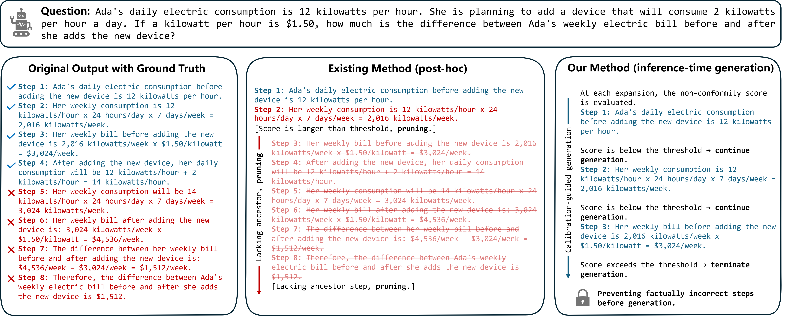

<h1 align="center">
# Inference-Time Conformal Reasoning with Valid Factuality Control for Large Language Models 🔥
</h1>

<div align="center">

[](https://openreview.net/)
[](https://github.com/) 
</div>

**International Conference on Machine Learning (ICML) 2026**



We introduce the **Inference-Time Conformal Reasoning(ITCR)**, which integrates conformal prediction directly into the generation of reasoning graphs and performs factuality control at inference time. This repo contains the implementation of ITCR. 

## Running Scripts
Run all commands from this directory:

```bash
cd ITCR-main
```

## Data
We automatically load select problems from the [GSM8K](https://arxiv.org/abs/2110.14168) dataset, but you can add new sets to the `data` repository.

## Conformal Prediction

### Training the mapping model

1. **Data preparation**  
   The script loads dependency graphs, splits into train vs calib+test, saves `train_graphs_<dataset>.pkl` / `calib_test_graphs_<dataset>.pkl`, builds random-walk subgraph samples with binary labels, and writes `train_pyg_<dataset>.pt` and `calib_test_pyg_<dataset>.pt`. By default, training reads `data/pre-trained/<dataset>/train_pyg_<dataset>.pt` and `calib_test_pyg_<dataset>.pt`, so place or symlink your `.pt` files there.

   ```bash
   python conformal/data.py
   ```

2. **Train classifier**  
   Loads the PyTorch Geometric `.pt` packs, extracts spectral + node features (`k_eigs` default 8), and fits a `FocalLossClassifier`. Saves `focal_model_<dataset>.pkl` next to the working directory used in the script; copy it to `data/pre-trained/<dataset>/` together with `calib_test_graphs_<dataset>.pkl` so evaluation can find the model and graphs.
   
   ```bash
   python conformal/train.py
   ```

### Evaluation (`main.py` / `main_no_miss.py`)

Both scripts load a trained focal classifier and serialized reasoning graphs, sweep over miscoverage levels `alpha`, and report empirical coverage plus efficiency. 

- ** “No false” **  
  Uses `get_prediction_set_new` and `calibrate_threshold`. Coverage means that every subgraph in the conformal prediction sequence is a coherent correct subgraph. Results (mean/std coverage and returned-node ratio over repeated calib/test splits) are shown. Optional: set `interpolation` (`"lower"`, `"linear"`, `"higher"`) for quantile interpolation when calibrating `lambda`.

  ```bash
  python conformal/main.py
  ```

- ** “No miss” **  
  Uses `get_prediction_set_no_missing` and `calibrate_threshold_no_missing`. Coverage is defined so that the subgraph includes all factually correct nodes. Results return coverage and efficiency statistics per `alpha`.

  ```bash
  python conformal/main_no_miss.py
  ```

## Downstream Reasoning

This step evaluates reasoning tasks when the base LLM is wrapped with **threshold-gated conformal reasoning** (`ThresholdGatedLLM` in `evaluation/llm_model.py`). The script loads a Hugging Face causal LM (default: `meta-llama/Meta-Llama-3.1-8B-Instruct`), the trained focal classifier from `data/pre-trained/<dataset>/focal_model_<dataset>.pkl`, and runs generation on a evaluation JSONL file (`question` / `answer` fields; gold numbers parsed from `#### ...`). Results show per-sample correctness by comparing the last numeric answer in the model output to the gold value (`evaluation/evaluation.py`).

**Before running:** place the pretrained focal model and graph artifacts under `data/pre-trained/<dataset>/` as in the conformal training section; and provide the evaluation JSONL (default path `data/gsm8k_open_ori_500.jsonl`). You can change your own `dataset`, `model_name`, miscoverage threshold `thr_*`, and paths directly in `evaluation/main.py`. 

```bash
python evaluation/main.py
```

## Reference

Please cite our work if you find it useful:

```bibtex

```

